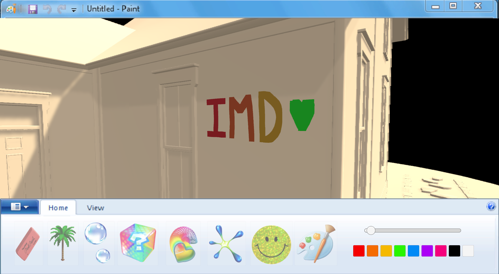
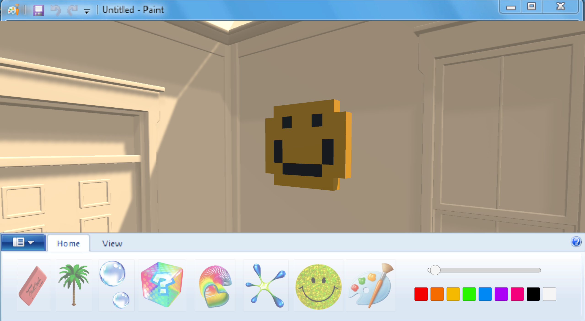
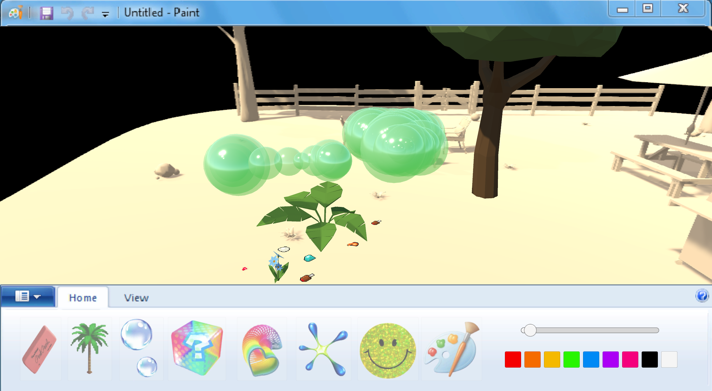

<!DOCTYPE html>
<html lang="en">
<head>
  <meta charset="UTF-8">
  <title>Retro Canvas (AR)</title>
</head>
<body>

  <h1>Retro Canvas (AR)</h1>

  

    Retro Canvas reimagines the iconic 1990s drawing software Kid Pix as an immersive
    augmented reality art experience. Instead of drawing on a flat screen, users create
    playful doodles, animations, and visual effects that exist directly within their
    physical environment.
  

   

  <h1>Images</h1>
  
  
  

    

  <h1>Video</h1>
  <a href="https://youtu.be/PNe_2xiRgo8">Watch the demo video</a>

</body>
</html>
